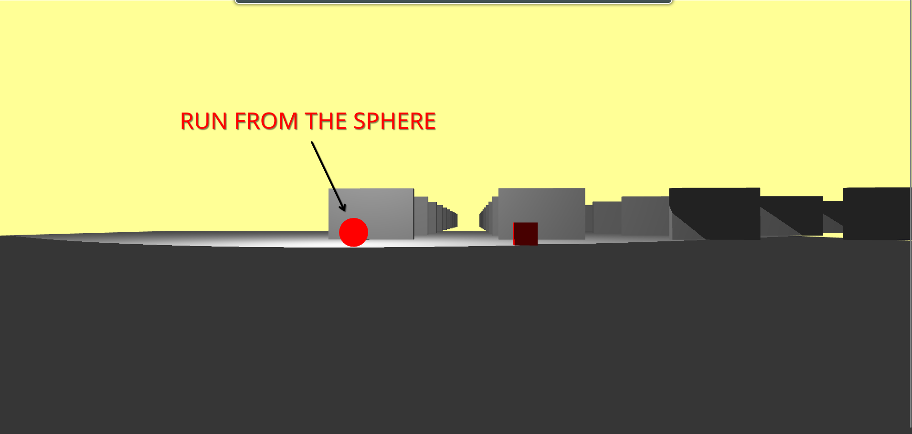

# Java Nextbot
 - João Bastos - 113470 TP-1
  
Run project: https://joaobastos023.github.io/javanextbot/scene.html

Repo: https://github.com/JoaoBastos023/javanextbot

## Objetives
    - Openworld with multiple walls
    - Walls have collision
    - User is holding a light and the scene is dark/with low lights
    - Sphere in the scene chasing the user
  
## What's done
    - First person view
    - Sphere chases the user, but once it hits a wall it stops there if you're not in the same x or z axis of the sphere without a wall intercepting it
    - Some walls to test collision
## What's left to do
    - Make the user hold a light and make scene dark
    - Possibly improve the sphere behaviour
    - Create an actual scene with the walls
    - Add textures

